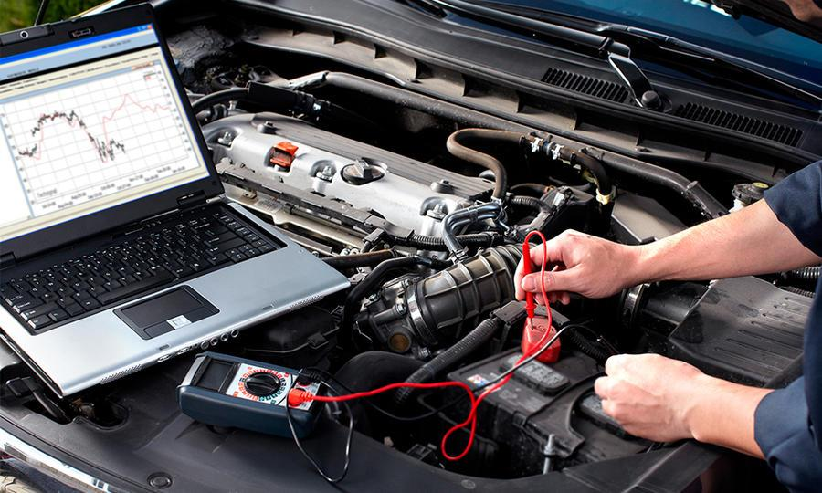
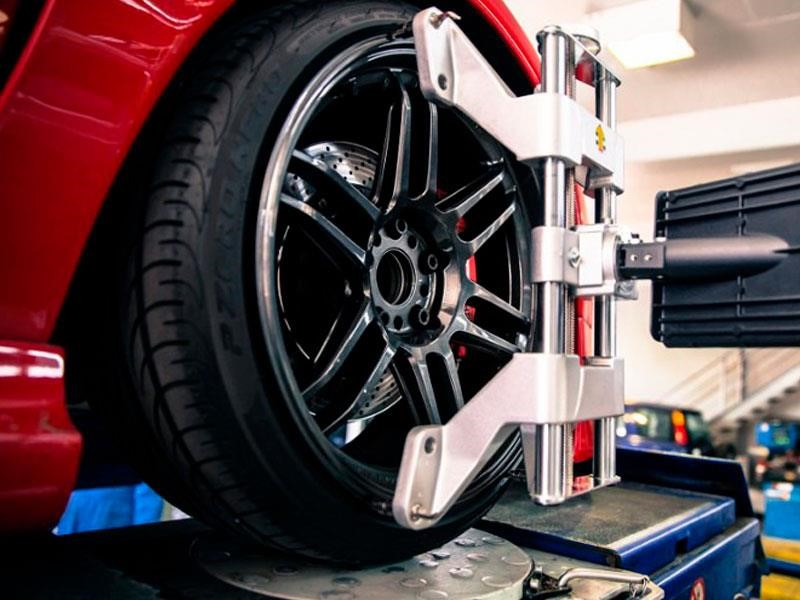

<!DOCTYPE html>
<html lang="en">

<head>
    <meta charset="utf-8">
    <title>Taller Mecánico CarServ</title>
    <meta content="width=device-width, initial-scale=1.0" name="viewport">
    <meta content="" name="keywords">
    <meta content="" name="description">

    <!-- Favicon -->
    <link href="img/favicon.ico" rel="icon">

    <!-- Google Web Fonts -->
    <link rel="preconnect" href="https://fonts.googleapis.com">
    <link rel="preconnect" href="https://fonts.gstatic.com" crossorigin>
    <link href="https://fonts.googleapis.com/css2?family=Barlow:wght@600;700&family=Ubuntu:wght@400;500&display=swap" rel="stylesheet">

    <!-- Icon Font Stylesheet -->
    <link href="https://cdnjs.cloudflare.com/ajax/libs/font-awesome/5.10.0/css/all.min.css" rel="stylesheet">
    <link href="https://cdn.jsdelivr.net/npm/bootstrap-icons@1.4.1/font/bootstrap-icons.css" rel="stylesheet">

    <!-- Libraries Stylesheet -->
    <link href="lib/animate/animate.min.css" rel="stylesheet">
    <link href="lib/owlcarousel/assets/owl.carousel.min.css" rel="stylesheet">
    <link href="lib/tempusdominus/css/tempusdominus-bootstrap-4.min.css" rel="stylesheet" />

    <!-- Customized Bootstrap Stylesheet -->
    <link href="css/bootstrap.min.css" rel="stylesheet">

    <!-- Template Stylesheet -->
    <link href="css/style.css" rel="stylesheet">
</head>

<body>
    <!-- Spinner Start -->
    

        

            Loading...
        

    

    <!-- Spinner End -->

    <!-- Topbar Start -->
    

        

            

                

                    <small class="fa fa-map-marker-alt text-primary me-2"></small>
                    <small>San Marcos 244, Querétaro, México</small>
                

                

                    <small class="far fa-clock text-primary me-2"></small>
                    <small>Lun - Sab : 09.00 AM - 09.00 PM</small>
                

            

            

                

                    <small class="fa fa-phone-alt text-primary me-2"></small>
                    <small>55 1989 7890</small>
                

                

                    <a class="btn btn-sm-square bg-white text-primary me-1" href=""><i class="fab fa-facebook-f"></i></a>
                    <a class="btn btn-sm-square bg-white text-primary me-0" href=""><i class="fab fa-instagram"></i></a>
                

            

        

    

    <!-- Topbar End -->

    <!-- Navbar Start -->
    <nav class="navbar navbar-expand-lg bg-white navbar-light shadow sticky-top p-0">
        
        <button type="button" class="navbar-toggler me-4" data-bs-toggle="collapse" data-bs-target="#navbarCollapse">
            
        </button>
        

            

                <a href="index.php" class="nav-item nav-link active">Inicio</a>
                <a href="nosotros.php" class="nav-item nav-link">Nosotros</a>
                <a href="generarservicio.php" class="nav-item nav-link">Generar Servicio</a>
                

                    <a href="#" class="nav-link dropdown-toggle" data-bs-toggle="dropdown">Servicios</a>
                    

                        <a href="service.php" class="dropdown-item">Mecánica</a>
                        <a href="service.php" class="dropdown-item">Hojalatería y Pintura Automotriz</a>
                        <a href="service.php" class="dropdown-item">Electricidad Automotriz</a>
                        <a href="service.php" class="dropdown-item">Escáner</a>
                        <a href="service.php" class="dropdown-item">Estética Automotriz</a>
                        <a href="service.php" class="dropdown-item">Venta y Montaje de Llantas</a>
                    

                

            

            <a href="Login/Index.php" class="btn btn-primary py-4 px-lg-5 d-none d-lg-block">Iniciar Sesión<i class="fa fa-arrow-right ms-3"></i></a>
        

    </nav>
    <!-- Navbar End -->

    <!-- Carousel Start -->
    

        

            

                

                    
                    

                        

                            

                                

                                    <h6 class="text-white text-uppercase mb-3 animated slideInDown">// Mantenimiento de
                                        automóviles //</h6>
                                    <h1 class="display-3 text-white mb-4 pb-3 animated slideInDown">Centro de servicio
                                        de reparación de automóviles calificado</h1>
                                    <a href="" class="btn btn-primary py-3 px-5 animated slideInDown">Saber más<i class="fa fa-arrow-right ms-3"></i></a>
                                

                                

                                    
                                

                            

                        

                    

                

                

                    
                    

                        

                            

                                

                                    <h6 class="text-white text-uppercase mb-3 animated slideInDown">// Mantenimiento de
                                        automóviles //</h6>
                                    <h1 class="display-3 text-white mb-4 pb-3 animated slideInDown">Centro de servicio
                                        de reparación de automóviles calificado</h1>
                                    <a href="" class="btn btn-primary py-3 px-5 animated slideInDown">Saber más<i class="fa fa-arrow-right ms-3"></i></a>
                                

                                

                                    
                                

                            

                        

                    

                

            

            <button class="carousel-control-prev" type="button" data-bs-target="#header-carousel" data-bs-slide="prev">
                
                Anterior
            </button>
            <button class="carousel-control-next" type="button" data-bs-target="#header-carousel" data-bs-slide="next">
                
                Siguiente
            </button>
        

    

    <!-- Carousel End -->

    <!-- Service Start -->
    

        

            

                

                    

                        <i class="fa fa-certificate fa-3x text-primary flex-shrink-0"></i>
                        

                            <h5 class="mb-3">Servicio de calidad</h5>
                            
Obtén un servicio seguro, libre de contacto físico y con una limpieza y sanitización
                                exhaustiva al término del servicio.

                            <a class="text-secondary border-bottom" href="">Leer más</a>
                        

                    

                

                

                    

                        <i class="fa fa-users-cog fa-3x text-primary flex-shrink-0"></i>
                        

                            <h5 class="mb-3">Técnicos Expertos</h5>
                            
Todos nuestros técnicos cuentan con certificación, además te ofrecemos el mismo servicio
                                profesional y personalizado que recibes con tu Distribuidor

                            <a class="text-secondary border-bottom" href="">Leer más</a>
                        

                    

                

                

                    

                        <i class="fa fa-tools fa-3x text-primary flex-shrink-0"></i>
                        

                            <h5 class="mb-3">Equipamiento Moderno</h5>
                            
Contamos con servicios especializados en instalación de llantas, servicio profesional de
                                montaje, balanceo, inflado con nitrógeno e incluso cambio de aceite.

                            <a class="text-secondary border-bottom" href="">Leer más</a>
                        

                    

                

            

        

    

    <!-- Service End -->

    <!-- About Start -->
    

        

            

                

                    

                        
                        

                            <h1 class="display-4 text-white mb-0">15 Años</h1>
                            <h4 class="text-white">Experiencia</h4>
                        

                    

                

                

                    <h6 class="text-primary text-uppercase">// ¿Quiénes somos? //</h6>
                    <h1 class="mb-4">CarServ Siendo el mejor lugar para el cuidado de
                        su automóvil</h1>
                    
Compromiso por la calidad, rapidez, confianza en el trabajo y lo más importante, la
                        seguridad e integridad de cada uno de nuestros clientes son los valores que hacen de CarServ una
                        empresa que día a día trabaja por ofrecer el mejor servicio integral automotriz desde hace 15
                        años.

                    

                        

                            

                                

                                    01
                                

                                

                                    <h6>Profesionales y Expertos</h6>
                                    Diam dolor diam ipsum sit amet diam et eos
                                

                            

                        

                        

                            

                                

                                    02
                                

                                

                                    <h6>Centro de Servicio de Calidad</h6>
                                    Diam dolor diam ipsum sit amet diam et eos
                                

                            

                        

                        

                            

                                

                                    03
                                

                                

                                    <h6>Trabajadores Ganadores de Premios</h6>
                                    Diam dolor diam ipsum sit amet diam et eos
                                

                            

                        

                    

                    <a href="" class="btn btn-primary py-3 px-5">Leer más<i class="fa fa-arrow-right ms-3"></i></a>
                

            

        

    

    <!-- About End -->

    <!-- Fact Start -->
    

        

            

                

                    <i class="fa fa-check fa-2x text-white mb-3"></i>
                    <h2 class="text-white mb-2" data-toggle="counter-up">15</h2>
                    
Años de Experiencia

                

                

                    <i class="fa fa-users-cog fa-2x text-white mb-3"></i>
                    <h2 class="text-white mb-2" data-toggle="counter-up">+25</h2>
                    
Técnicos Expertos

                

                

                    <i class="fa fa-users fa-2x text-white mb-3"></i>
                    <h2 class="text-white mb-2" data-toggle="counter-up">+1050</h2>
                    
Clientes Satisfechos

                

                

                    <i class="fa fa-car fa-2x text-white mb-3"></i>
                    <h2 class="text-white mb-2" data-toggle="counter-up">+1050</h2>
                    
Servicios Completos

                

            

        

    

    <!-- Fact End -->

    <!-- Service Start -->
    

        

            

                <h6 class="text-primary text-uppercase">// Nuestros Servicios //</h6>
                <h1 class="mb-5">Catálogo de Servicios</h1>
            

            

                

                    

                        <button class="nav-link w-100 d-flex align-items-center text-start p-4 mb-4 active" data-bs-toggle="pill" data-bs-target="#tab-pane-1" type="button">
                            <i class="fa fa-car-side fa-2x me-3"></i>
                            <h4 class="m-0">Mecánica</h4>
                        </button>
                        <button class="nav-link w-100 d-flex align-items-center text-start p-4 mb-4" data-bs-toggle="pill" data-bs-target="#tab-pane-2" type="button">
                            <i class="fa fa-car fa-2x me-3"></i>
                            <h4 class="m-0">Hojalatería y Pintura Automotriz</h4>
                        </button>
                        <button class="nav-link w-100 d-flex align-items-center text-start p-4 mb-4" data-bs-toggle="pill" data-bs-target="#tab-pane-3" type="button">
                            <i class="fa fa-bolt fa-2x me-3"></i>
                            <h4 class="m-0">Electricidad Automotriz</h4>
                        </button>
                        <button class="nav-link w-100 d-flex align-items-center text-start p-4 mb-4" data-bs-toggle="pill" data-bs-target="#tab-pane-4" type="button">
                            <i class="fa fa-wrench fa-2x me-3"></i>
                            <h4 class="m-0">Escáner</h4>
                        </button>
                        <button class="nav-link w-100 d-flex align-items-center text-start p-4 mb-4" data-bs-toggle="pill" data-bs-target="#tab-pane-5" type="button">
                            <i class="fa fa-car fa-2x me-3"></i>
                            <h4 class="m-0">Estética Automotriz</h4>
                        </button>
                        <button class="nav-link w-100 d-flex align-items-center text-start p-4 mb-4" data-bs-toggle="pill" data-bs-target="#tab-pane-6" type="button">
                            <i class="fa fa-credit-card fa-2x me-3"></i>
                            <h4 class="m-0">Venta y Montaje de llantas</h4>
                        </button>
                    

                

                

                    

                        

                            

                                

                                    

                                        
                                    

                                

                                

                                    <h3 class="mb-3">15 Años de experiencia en servicio automotriz</h3>
                                    
El correcto funcionamiento de tu automóvil es nuestro compromiso.
                                        Contamos con una amplia diversidad de servicios en mecánica express, general y
                                        mayor que van desde
                                        alineación de ruedas hasta reparaciones de motor.

                                    
<i class="fa fa-check text-success me-3"></i>Servicio de Calidad

                                    
<i class="fa fa-check text-success me-3"></i>Técnicos Expertos

                                    
<i class="fa fa-check text-success me-3"></i>Equipo de última tecnología

                                    <a href="" class="btn btn-primary py-3 px-5 mt-3">Solicitar Cotización<i class="fa fa-arrow-right ms-3"></i></a>
                                

                            

                        

                        

                            

                                

                                    

                                        
                                    

                                

                                

                                    <h3 class="mb-3">Dando la Mejor imagen a tu Auto</h3>
                                    
¡Que tu auto no pierda el encanto! Si tu auto sufrió una colisión,
                                        golpe o abolladura, recupera aquí la imagen que lo hizo atraer tu atención
                                        cuando lo viste por primera vez. Conoce los servicios
                                        en hojalatería y pintura y haz que te vehículo vuelva a sonreír.

                                    
<i class="fa fa-check text-success me-3"></i>Pintura de Calidad

                                    
<i class="fa fa-check text-success me-3"></i>Hojalateros Expertos

                                    
<i class="fa fa-check text-success me-3"></i>Bañado de Pintura

                                    <a href="" class="btn btn-primary py-3 px-5 mt-3">Solicitar Cotización<i class="fa fa-arrow-right ms-3"></i></a>
                                

                            

                        

                        

                            

                                

                                    

                                        
                                    

                                

                                

                                    <h3 class="mb-3">Sistema Eléctrico de tu Auto</h3>
                                    
Es de vital importancia que el sistema eléctrico de tu automóvil
                                        esté
                                        siempre en óptimas condiciones, por eso, en CarServ nos ocupamos de diagnosticar
                                        fallos y hacer remplazo de piezas necesarias para asegurar el buen
                                        funcionamiento del mismo.

                                    
<i class="fa fa-check text-success me-3"></i>Escáner

                                    
<i class="fa fa-check text-success me-3"></i>Diagnóstico de Fallos

                                    
<i class="fa fa-check text-success me-3"></i>Remplazo de Piezas

                                    <a href="" class="btn btn-primary py-3 px-5 mt-3">Solicitar Cotización<i class="fa fa-arrow-right ms-3"></i></a>
                                

                            

                        

                        

                            

                                

                                    

                                        
                                    

                                

                                

                                    <h3 class="mb-3">Escaneo Automotriz</h3>
                                    
Si tu auto presenta una luz encendida en el tablero, podemos hacer
                                        un diagnóstico
                                        exacto de las fallas con el escáner, una herramienta que nos sirve
                                        para realizar una lectura del historial de errores de tu vehículo que
                                        nos permite realizar una correcta reparación.

                                    
<i class="fa fa-check text-success me-3"></i>Herramientas Especializadas

                                    
<i class="fa fa-check text-success me-3"></i>Correcto Diagnóstico

                                    
<i class="fa fa-check text-success me-3"></i>Reparación Inmediata

                                    <a href="" class="btn btn-primary py-3 px-5 mt-3">Solicitar Cotización<i class="fa fa-arrow-right ms-3"></i></a>
                                

                            

                        

                        

                            

                                

                                    

                                        
                                    

                                

                                

                                    <h3 class="mb-3">Tuneame la Nave</h3>
                                    
Un auto con buen funcionamiento es ideal, pero que tenga una
                                        excelente imagen
                                        es mucho mejor. En CarServ nos encargamos
                                        del lavado de interiores y exteriores, pulido y encerado
                                        y hasta lavado de motor.

                                    
<i class="fa fa-check text-success me-3"></i>Lavado Extremo

                                    
<i class="fa fa-check text-success me-3"></i>Cuidado del Vehículo

                                    
<i class="fa fa-check text-success me-3"></i>Servicios Extras

                                    <a href="" class="btn btn-primary py-3 px-5 mt-3">Solicitar Cotización<i class="fa fa-arrow-right ms-3"></i></a>
                                

                            

                        

                        

                            

                                

                                    

                                        
                                    

                                

                                

                                    <h3 class="mb-3">Experiencia en Venta y Colocación de Llantas</h3>
                                    
Las llantas son uno de los puntos de seguridad más
                                        importantes en un automóvil. En CarServ contamos
                                        con diferentes servicios como alineación y balanceo, además,
                                        tenemos a la venta las mejores marcas de llantas en el mercado.

                                    
<i class="fa fa-check text-success me-3"></i>Alineación y Balanceo

                                    
<i class="fa fa-check text-success me-3"></i>Varias Marcas

                                    
<i class="fa fa-check text-success me-3"></i>Seguridad

                                    <a href="" class="btn btn-primary py-3 px-5 mt-3">Solicitar Cotización<i class="fa fa-arrow-right ms-3"></i></a>
                                

                            

                        

                    

                

            

        

    

    <!-- Service End -->

    <!-- Booking Start -->
    <!-- 

        

            

                

                    

                        <h1 class="text-white mb-4">Certified and Award Winning Car Repair Service Provider</h1>
                        
Eirmod sed tempor lorem ut dolores. Aliquyam sit sadipscing kasd
                            ipsum. Dolor ea et dolore et at sea ea at dolor, justo ipsum duo rebum sea invidunt
                            voluptua. Eos vero eos vero ea et dolore eirmod et. Dolores diam duo invidunt lorem. Elitr
                            ut dolores magna sit. Sea dolore sanctus sed et. Takimata takimata sanctus sed.

                    

                

                

                    

                        <h1 class="text-white mb-4">Book For A Service</h1>
                        <form>
                            

                                

                                    <input type="text" class="form-control border-0" placeholder="Your Name"
                                        style="height: 55px;">
                                

                                

                                    <input type="email" class="form-control border-0" placeholder="Your Email"
                                        style="height: 55px;">
                                

                                

                                    <select class="form-select border-0" style="height: 55px;">
                                        <option selected>Select A Service</option>
                                        <option value="1">Service 1</option>
                                        <option value="2">Service 2</option>
                                        <option value="3">Service 3</option>
                                    </select>
                                

                                

                                    

                                        <input type="text" class="form-control border-0 datetimepicker-input"
                                            placeholder="Service Date" data-target="#date1" data-toggle="datetimepicker"
                                            style="height: 55px;">
                                    

                                

                                

                                    <textarea class="form-control border-0" placeholder="Special Request"></textarea>
                                

                                

                                    <button class="btn btn-secondary w-100 py-3" type="submit">Book Now</button>
                                

                            

                        </form>
                    

                

            

        

    
 -->
    <!-- Booking End -->

    <!-- Footer Start -->
    

        

            

                

                    <h4 class="text-light mb-4">Dirección</h4>
                    
<i class="fa fa-map-marker-alt me-3"></i>San Marcos 244, Querétaro, México

                    
<i class="fa fa-phone-alt me-3"></i>55 1986 7890

                    
<i class="fa fa-envelope me-3"></i>carservicesinfo@carserv.com

                    

                        <a class="btn btn-outline-light btn-social" href=""><i class="fab fa-facebook-f"></i></a>
                        <a class="btn btn-outline-light btn-social" href=""><i class="fab fa-instagram"></i></a>
                    

                

                

                    <h4 class="text-light mb-4">Horarios de Servicio</h4>
                    <h6 class="text-light">Lunes - Sábado:</h6>
                    
09.00 AM - 09.00 PM

                    <h6 class="text-light">Domingo:</h6>
                    
Cerramos

                

                

                    <h4 class="text-light mb-4">Servicios</h4>
                    <a class="btn btn-link" href="">Mecánica</a>
                    <a class="btn btn-link" href="">Hojalatería y Pintura Automotriz</a>
                    <a class="btn btn-link" href="">Electricidad Automotriz</a>
                    <a class="btn btn-link" href="">Escáner</a>
                    <a class="btn btn-link" href="">Estética Automotriz</a>
                    <a class="btn btn-link" href="">Venta y Montaje de Llantas</a>
                

            

        

        

            

                

                    

                        &copy; <a class="border-bottom" href="#"> 2022 CARSERV, SA DE CV.</a>Todos los derechos
                        reservados.

                        <!--/*** This template is free as long as you keep the footer author’s credit link/attribution link/backlink. If you'd like to use the template without the footer author’s credit link/attribution link/backlink, you can purchase the Credit Removal License from "https://htmlcodex.com/credit-removal". Thank you for your support. ***/-->
                        Diseñado por: <a class="border-bottom">Karla Cecilia González Carrasco</a>
                         
                    

                

            

        

    

    <!-- Footer End -->

    <!-- Back to Top -->
    <a href="#" class="btn btn-lg btn-primary btn-lg-square back-to-top"><i class="bi bi-arrow-up"></i></a>

    <!-- JavaScript Libraries -->
    
    
    
    
    
    
    
    
    
    
    
    

    <!-- Template Javascript -->
    
</body>

</html>
